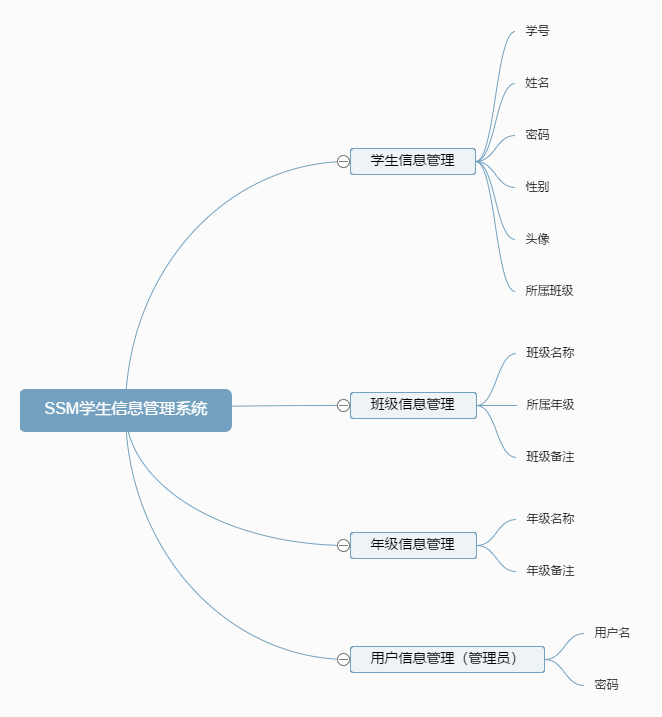
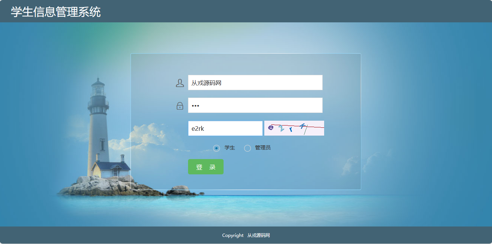
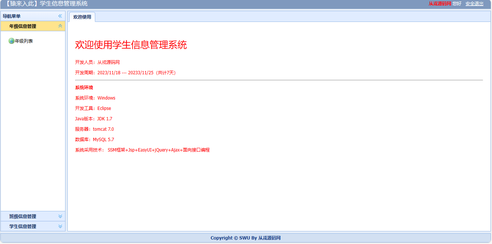
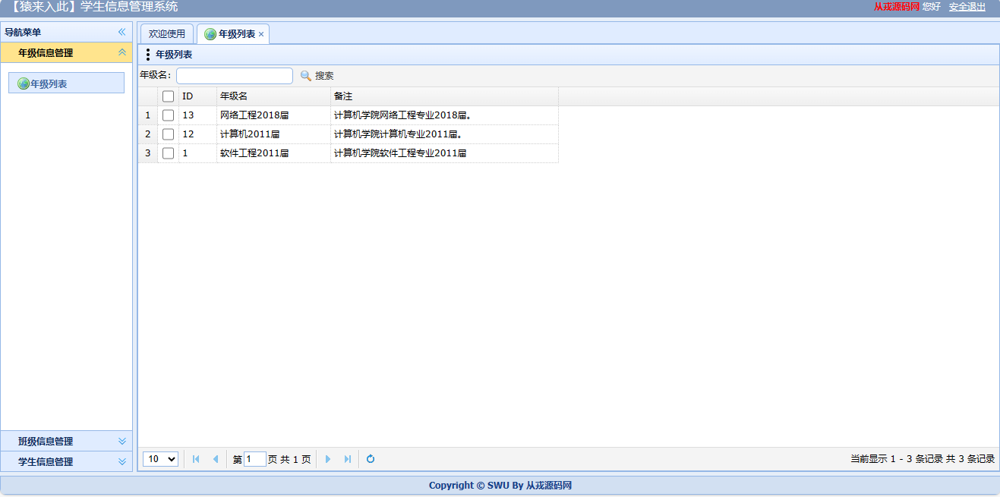
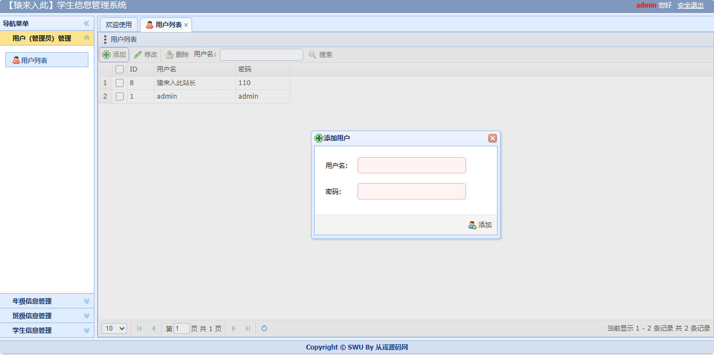
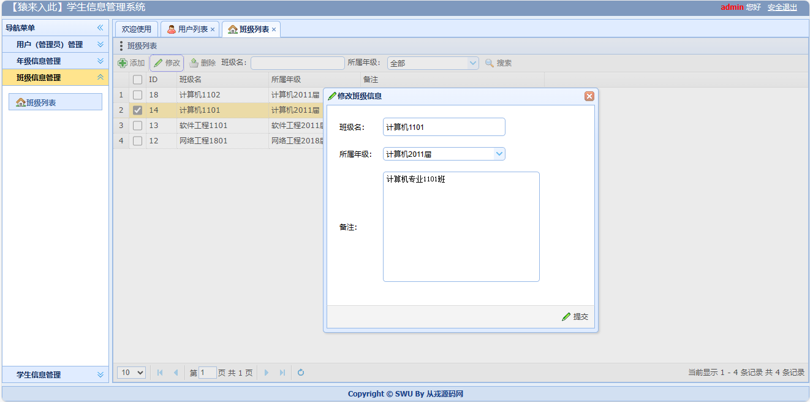
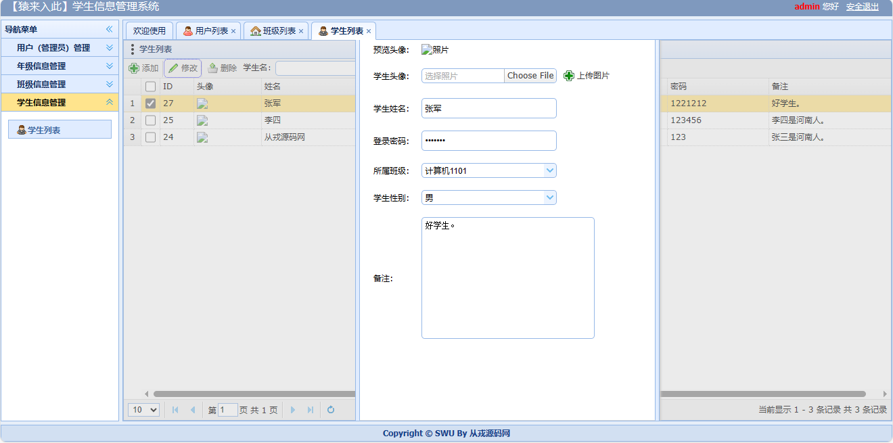

<h1 align="center">42.基于ssm的学生信息管理系统</h1>

 获取sql文件 QQ: 386869957 QQ群: 377586148 

 [推荐站点: 从戎源码网](https://armycodes.com/) 

## 简介

> 本代码来源于网络,仅供学习参考使用!
> 
> 登录地址：http://localhost:8080/
> 
> 管理员：admin admin
>
> 学生：从戎源码网 123
> 

## 项目介绍
基于ssm的学生信息管理系统：前端jsp、jquery、easyUI，后端 spring、mybatis，集成学生信息管理、班级管理、年级管理等功能于一体的系统。

## 功能介绍

- 增删查改、分页、模糊查询、权限管理、登录拦截

- 管理员列表（增加、查看、修改、删除、批量删除）
- 年级列表（增加、查看、修改、删除、批量删除）
- 班级列表（增加、查看、修改、删除、批量删除）
- 学生列表（修改）

## 环境

- <b>IntelliJ IDEA 2009.3</b>

- <b>Mysql 5.7.26</b>

- <b>Tomcat 7.0.73</b>

- <b>JDK 1.8</b>

## 运行截图

